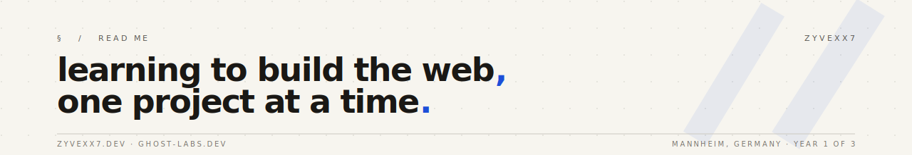

<a href="https://zyvexx7.dev">
  
</a>

<div align="center">

<br />


<br />


<br />

**18** · learning web dev · based in **Mannheim, Germany**

<br />

<a href="https://zyvexx7.dev"></a>
<a href="https://ghost-labs.dev"></a>
<a href="mailto:melnikmic14@gmx.de"></a>

</div>

---

### About

<table>
<tr>
<td width="55%" valign="top">

<br />

Mid-apprenticeship as a **retail salesman**. The day job pays the rent — evenings and weekends go into the web.

I'm **learning web development** properly: mostly React, lots of cleanup CSS, more proper backend work, and figuring out databases that aren't SQLite. I don't ship what I don't understand — so what you find here is exactly where I am right now.

Building real projects beats grinding tutorials, every time.

<br />

</td>
<td width="45%" valign="top">

```js
const micha = {
  age:      18,
  city:     'Mannheim, DE',
  daytime:  'retail apprentice',
  evening:  'learning web dev',
  stack:    ['React', 'Vite',
             'Tailwind', 'Node'],
  building: 'ghost-labs.dev',
  speaks:   ['de', 'en', 'a bit of ru'],
  status:   'still figuring it out',
}
```

</td>
</tr>
</table>

---

### Currently building

<table>
<tr>
<td width="50%" valign="top">

#### [GhostLabs](https://ghost-labs.dev) &nbsp;<kbd>beta</kbd>

*no-code Discord bot builder*

Build Discord bots through a visual dashboard — no programming required. Embedded docs for every block, focused on UX over feature dumps. My main project right now.

</td>
<td width="50%" valign="top">

#### [zyvexx7.dev](https://zyvexx7.dev) &nbsp;<kbd>live</kbd>

*personal site & internal tooling*

Vite + React, self-hosted on a single VPS behind Cloudflare. Includes a small internal admin CRM and an image CDN behind the scenes. Trilingual greeting on the homepage.

</td>
</tr>
</table>

---

### Stack & tools

<p>
  
  
  
  
  
</p>
<p>
  
  
  
  
  
</p>

---

### Live status

<div align="center">

<a href="https://discord.com/users/1449131916669354115">
  
</a>

<sub>updated in real-time via <a href="https://github.com/Phineas/lanyard">Lanyard</a></sub>

</div>

---

### Numbers

<div align="center">


<br />


<br />


</div>

---

<div align="center">
<sub><i>still learning. still building. still here.</i></sub>
</div>
